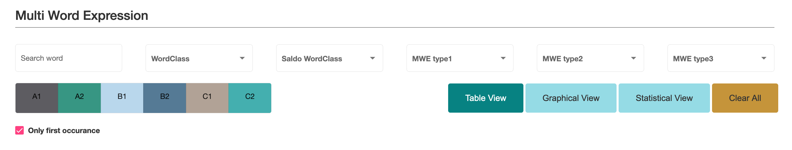
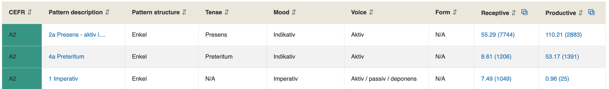

# Swedish L2 profiles
_Elena Volodina, Therese Lindström Tiedemann and Samir Yousuf Ali Mohammed, September 2021_

Online version: [https://spraakbanken.github.io/L2_profiles/SwedishL2profiles](https://spraakbanken.github.io/L2_profiles/SwedishL2profiles)

_____________________________________________________________________________________

## Contents

[1. General description](#1-general-description)

   - [1.1 L2P project](#11-l2p-project)
 
   - [1.2 Corpora used in the project](#12-corpora-used-in-the-project)
 
[2. User interface](#2-user-interface)
   
  - [2.1 Filters](#21-filters)

  - [2.2 Table view](#22-table-view)
  
  - [2.3 Frequency information](#23-frequency-information)

  - [2.4 Graphical view](#24-graphical-view)

  - [2.5 Statistical view](#25-statistical-view)

[3. Swedish lexical profile](#3-swedish-lexical-profile)

   - [3.1 Adjectival declension](#31-adjectival-declension)
   
   - [3.2 Adjectival adverbial structure](#32-adjectival-adverbial-structure)
   
   - [3.3 Multi-word expressions](#33-multi-word-expressions)
   
   - [3.4 Sen\*Lex](#34-senlex)

[4. Swedish grammatical profile](#4-swedish-grammatical-profile)

   - [4.1 Morpho-syntactic descriptors](#41-morpho-syntactic-descriptors)
   
   - [4.2 Noun phrases](#42-noun-phrases)
   
   - [4.3 Verb phrases](#43-verb-phrases)

[5. Swedish morphological profile](#5-swedish-morphological-profile)

   - [5.1 Word family](#51-word-family)
   
   - [5.2 Morpheme family](#52-morpheme-family)
   

_____________________________________________________________________________________

## 1. General description

_____________________________________________________________________________________

### 1.1 L2P project

The project [Development of lexical and grammatical competences in immigrant Swedish](https://spraakbanken.gu.se/en/projects/l2profiles), funded by Riksbankens Jubileumsfond, 2018-2021, focused on analysis of learners' vocabulary and grammar, and how they are learnt. We performed the study through two corpora: a corpus of coursebook texts and a corpus of learner essays (see below), both marked up for proficiency levels according to the Common European Framework of References (CEFR). The corpora have been processed by computational methods, after which the results have been analysed by linguists, lexicographers, grammarians, teachers and language assessors - both linguistically, and based on theory of teaching, to find ways of identifying minimal or central (need-to-know) vocabulary and grammar scopes, as well as peripheral (good-to-know) grammar and vocabulary at each level of proficiency as a way to support teachers, test-makers, assessor and learners. The aim of this project has, thus, been to provide an extensive description of what lexical and grammatical competence learners at each level possess, both receptively and productively, and explore the relation between the receptive and productive scopes. 

The project has resulted in a [Swedish L2 profiles](https://spraakbanken.gu.se/larkalabb/svlp) (SweL2P) resource - a practical digital tool that offers teachers, students, researchers and developers a possibility to explore and study themselves various aspects of learner language or use those for development of various methods or applications for second language learning. Since the focus of the project has been on description of learner language (rather than being of prescriptive nature), we offer all interested user groups a possibility to explore the [SweL2P](https://spraakbanken.gu.se/larkalabb/svlp) themselves and make their own conclusions. 

_____________________________________________________________________________________

### 1.2 Corpora used in the project

**COCTAILL** is a corpus of course books used for teaching Swedish as a second language (L2). Each chapter is the course books has been marked by teachers for the level of proficiency at which it has been used in courses for non-native Swedish speakers. COCTAILL contains course books at five of the six CEFR (Common European Framework of Reference) levels: A1 (beginner), A2, B1, B2, C1 (advanced). C2 (near-native) is missing. This corpus is used to get an approximation of what vocabulary and grammar L2 learners meet when reading, and are expected to understand **receptively**.

*Statistics over Coctaill corpus (receptive)*

| CEFR level |  Nr sentences | Nr tokens | 
|:-----------|:--------------|:----------|
| A1         | 7 583         |37 149| 
| A2         | 14 006        |84 996|  
| B1         | 18 528        |154 013| 
| B2         | 16 649        |164 322| 
| C1         | 16 668        |176 634| 
| C2         | 0             |0| 
| None       | 3 397         |34 885| 
| Total      | 76 831        |651 999|

_Reference_: 
* Elena Volodina, Ildikó Pilán, Stian Rødven Eide and Hannes Heidarsson 2014. [You get what you annotate: a pedagogically annotated corpus of coursebooks for Swedish as a Second Language.](http://www.ep.liu.se/ecp/107/010/ecp14107010.pdf) Proceedings of the third workshop on NLP for computer-assisted language learning. NEALT Proceedings Series 22 / Linköping Electronic Conference Proceedings 107: 128–144.

_____________________________________________________________________________________

**SweLL-pilot** is a corpus contating essays written by learners of Swedish as a second language. The essays have been collected from three separate schools, and have been labeled with the CEFR labels by experts. Essays represent the six levels A1 - C2, although C2 is represented by two essays only. This corpus is used to get an approximation of what vocabulary and grammar L2 learners are able to produce actively when writing, and therefore represent learners' **productive** abilities.

*Statistics over SweLL-pilot corpus (productive)*

| CEFR level | Nr sentences| Nr tokens  |     
|:-----------|:------------|:-----------|
| A1         | 633         |5 172       |  
| A2         | 2 616       |27 304      | 
| B1         | 1 719       |24 853      |
| B2         | 2 691       |45 684      |
| C1         | 2 887       |52 048      |
| C2         | 175         |3 294       |
| None       | 148         |1 706       |
| Total      | 10 869      |160 061     |

_References_: 

* Elena Volodina, Ildikó Pilán, Ingegerd Enström, Lorena Llozhi, Peter Lundkvist, Gunlög Sundberg, Monica Sandell. 2016. [SweLL on the rise: Swedish Learner Language corpus for European Reference Level studies.](http://arxiv.org/pdf/1604.06583v1.pdf) Proceedings of LREC 2016, Slovenia.
* Description per subcorpus:
    * SpIn (part of SweLL-pilot): https://spraakbanken.github.io/swell-release-v1/Metadata-SpIn
    * SW1203 (part of SweLL-pilot): https://spraakbanken.github.io/swell-release-v1/Metadata-SW1203
    * TISUS 2007 (part of SweLL-pilot): https://spraakbanken.github.io/swell-release-v1/Metadata-TISUS

_____________________________________________________________________________________

## 2. User interface

_____________________________________________________________________________________

The [SweL2P](https://spraakbanken.gu.se/larkalabb/svlp) features three main profiles:

* [lexical profile](https://spraakbanken.github.io/L2_profiles/SwedishL2profiles#3-swedish-lexical-profile), organized by words, multi-word expressions and a few other aspects of vocabulary
* [grammatical profile](https://spraakbanken.github.io/L2_profiles/SwedishL2profiles#4-swedish-grammatical-profile), organized by noun phrases, verb phrases and morpho-syntactic descriptors
* [morphological profile](https://github.com/spraakbanken/L2_profiles/blob/master/SwedishL2profiles.md#5-swedish-morphological-profile), organized into word family and morpheme family

Each item or pattern in the profile can be 
* [filtered](https://spraakbanken.github.io/L2_profiles/SwedishL2profiles#21-filters) in various ways depending on the category in focus, 
* explored through actual corpus **hits in Korp** and through associated information in a [Table view](https://spraakbanken.github.io/L2_profiles/SwedishL2profiles#22-table-view), 
* studied through [Statistical view](https://spraakbanken.github.io/L2_profiles/SwedishL2profiles#25-statistical-view) and/or 
* through graphs in the [Graphical view](https://spraakbanken.github.io/L2_profiles/SwedishL2profiles#24-graphical-view). 
 
The entire dataset / filtered data selection can be downloaded. 

For each of the three profiles (lexical, grammatical and morphological), you can find a more detailed description under the relevant subsection in this document.

_____________________________________________________________________________________

### 2.1 Filters

Link: https://spraakbanken.github.io/L2_profiles/SwedishL2profiles#21-filters

Filters appear on the top and can be _free-text_, (multiple) choices from _drop-down menus_, _tick boxes_ or _buttons_. For each individual category there is an individual set of filters, below examplified using Multi-Word Expressions under the Swedish L2 Lexical Profile.

If you are interested in filters applicable to other parts of the Swedish L2 Profile, please, check the relevant subsection under the top sections: [Lexical Profile](https://spraakbanken.github.io/L2_profiles/SwedishL2profiles#3-swedish-lexical-profile), [Grammatical Profile](https://spraakbanken.github.io/L2_profiles/SwedishL2profiles#4-swedish-grammatical-profile), [Morphological Profile](https://spraakbanken.github.io/L2_profiles/SwedishL2profiles#5-swedish-morphological-profile)).

An example for Multi-Word Expressions (MWEs) shows 

* Search word - a free-text window  
* Word classes - a drop-down menu to limit the search to a (set of) word class(es) as defined in the SUC corpus (22 categories)
* Saldo word classes - a drop-down menu to limit the search to a (set of) word class(es) as defined in the Saldo lexicon (37 categories)
* MWE Type 1 - a drop-down menu to limit the search to _contiguous_ or _non-contiguous_ MWEs
* MWE Type 2 - a drop-down menu to limit the search to 9 categories by word classes
* MWE Type 3 - a drop-down menu to filter various subtypes of verbal MWEs

* Under the first row of filters, there is a possibility to click on the CEFR level buttons to select items appearing at a particular level. Each button is of a _toggle_ character: the first click selects the level, the second one de-selects it. Several levels can be selected simultaneously.
* Only first occurrence - a tick-box showing each MWE item only once, at the level where it appears for the first time (hiding its appearance at other levels).
* Various views - [Table](https://spraakbanken.github.io/L2_profiles/SwedishL2profiles#22-table-view), [Graphical](https://spraakbanken.github.io/L2_profiles/SwedishL2profiles#24-graphical-view) and [Statistical](https://spraakbanken.github.io/L2_profiles/SwedishL2profiles#25-statistical-view) are described in separate subsections.

_____________________________________________________________________________________

### 2.2 Table view

Link: https://spraakbanken.github.io/L2_profiles/SwedishL2profiles#22-table-view

The **Table view** lists all items, e.g. multi-word expressions or verb patterns, with associated information about them (similar to an Excel sheet) one by one in rows. Columns  with descriptive information depend on the item in focus, below illustrateed for the Swedish Word Family. 

If you are interested in columns/table view applicable to other parts of the Swedish L2 Profile, please, check the relevant subsection under the top sections: [Lexical Profile](https://spraakbanken.github.io/L2_profiles/SwedishL2profiles#3-swedish-lexical-profile), [Grammatical Profile](https://spraakbanken.github.io/L2_profiles/SwedishL2profiles#4-swedish-grammatical-profile), [Morphological Profile](https://spraakbanken.github.io/L2_profiles/SwedishL2profiles#5-swedish-morphological-profile)).

To examplify the table view, please look below at the Swedish Word Family that contains the following columns with descriptive information:

* Root - the root of the word, e.g. _bröd_
* CEFR level where that root appears at - once for each level and vocabulary item where they appear
* Lemgram which the roos is a part of, e.g. _tunnbröd_. The lemgram can be clicked to see information about its **morphological analysis** by the project annotators and from _svenska.se_, and a link to its **definition** in _svenska.se_
* Sense - the sense of the lemgram according to Saldo identifiers (only relevant for polysemous words/lemgrams)
* Wordclass - which word class this lemgram belongs to, based on a taxonomy from the SUC corpus (22 categories)
* Saldo wordclass - which word class this lemgram belongs to, based on a taxonomy from the Saldo lexicon (37 categories)
* WordFormation - which word formation mechanism describes this particular lemgram (7 categories), in the case of _tunnbröd_ the WordFormation mechanism is _compound_
* Receptive - frequency information about the use of the root in the corpus of course books (Coctaill) with a link to Korp hits containing those items. Values are provided in relative and absolute numbers, see section on [Frequency information](https://spraakbanken.github.io/L2_profiles/SwedishL2profiles#23-frequency-information) for explanations
* Productive - frequency information about the use of the root in the corpus of essays (SweLL-pilot) with a link to Korp hits containing those items. Values are provided in relative and absolute numbers, see section on [Frequency information](https://spraakbanken.github.io/L2_profiles/SwedishL2profiles#23-frequency-information) for explanations

Clicking on the arrows in the column names will sort the whole table according to the values in that column: either alphabetically if the values are strings; or in descending/ascending order if the values are numerical.

For some of the profiles (e.g. for _Verb patterns_ under the _Grammatical Profile_), columsn can be added or removed using a tick box "Extend columns..."

_____________________________________________________________________________________

### 2.3 Frequency information

Link: https://spraakbanken.github.io/L2_profiles/SwedishL2profiles#23-frequency-information

We present two types of frequency - receptive and productive - for each item in the Table view. **Receptive frequency** comes from the COCTAILL corpus (coursebooks, including both reading texts and activities surrounding it). **Productive frequency** comes from the SweLL-pilot corpus (learner essays). In each case, we report the **absolute frequency** (i.e. number of hits/tokens) for the current item at a particular level, and its **relative frequency**. The numbers are **clickable**, and open a full list of hits using Korp search interface (Ahlberg et al. 2013).

To exemplify, the Figure above shows Verb patterns at A2 level. _Preteritum_ (Past Simple) has numbers 8.61 (1206) for Receptive count and 53.17 (1391) for Productive one. The **absolute frequency** of hits, 1206, means that the pattern has been used 1206 times in the course books at A2 level. **Relative frequency** for Noun and Verb patterns is calculated with reference to the number of sentences at this particular level, i.e. 1206 occurrences of the Past Simple pattern is divided by 14006 sentences at A2 level and multiplied (i.e. normalized) by 100 = 8.6. This contrasts to the essay data: 1391 occurrences of the Past Simple in 2616 sentences at A2 level makes it a very frequent pattern with a relative frequency 53.17.

**The relative frequency** is normalized 

- towards the total number of tokens per level (Lexical and Morphological profile)
- towards to total number of sentences at a given level of proficiency (Grammar profile). 

_References:_ 

* Malin Ahlberg, Lars Borin, Markus Forsberg, Martin Hammarstedt, Leif-Jöran Olsson, Olof Olsson, Johan Roxendal, Jonatan Uppström (2013): Korp and Karp – a bestiary of language resources: the research infrastructure of Språkbanken, in Proceedings of the 19th Nordic Conference of Computational Linguistics (NODALIDA 2013), May 22–24, 2013, Oslo University, Norway. NEALT Proceedings Series 16, utgåva 16, sidor 429-433.

_____________________________________________________________________________________

### 2.4 Graphical view

Link: https://spraakbanken.github.io/L2_profiles/SwedishL2profiles#24-graphical-view

_____________________________________________________________________________________

### 2.5 Statistical view

Link: https://spraakbanken.github.io/L2_profiles/SwedishL2profiles#25-statistical-view

_____________________________________________________________________________________

## 3. Swedish lexical profile

Link: https://spraakbanken.github.io/L2_profiles/SwedishL2profiles#3-swedish-lexical-profile

_____________________________________________________________________________________

### 3.1 Adjectival declension

### 3.2 Adjectival adverbial structure

### 3.3 Multi-word expressions

### 3.4 Sen\*Lex

_____________________________________________________________________________________

## 4. Swedish grammatical profile

Link: https://spraakbanken.github.io/L2_profiles/SwedishL2profiles#4-swedish-grammatical-profile

_____________________________________________________________________________________

### 4.2 Morpho-syntactic descriptors

### 4.2 Noun phrases

### 4.3 Verb phrases

**FILTERS**:

| **FILTER NAME**                |  Filter description           |  | 
|:------------------------|:--------------|:----------|
| PATTERN DESCRIPTION     | A drop-down menu to filter verb patterns to the one(s) selected. Multiple selections are possible.  || 
|                         | There are 38 patterns (see below), see details [here](https://spraakbanken.github.io/L2_profiles/Verb_patterns).||
|                         |Not all patterns are shown in the Grammar profile due to their absence in the source corpora ||
|| 1. Verbfraser med imperativ || 
||   * (1) Imperativ || 
|| 2. Verbfraser med presens || 
||    * (2a) Presens - aktiv inklusive hjälpverb || 
||    * (2b) Presens - aktiv exklusive hjälpverb||  
||    * (3a) Presens - s-passiv el. deponens || 
||    * (3b) Presens - s-passiv || 
||    * (3c) Presens - deponens || 
|| 3. Verbfraser med preteritum || 
||    * (4a)  Preteritum - aktiv inklusive hjälpverb || 
||    * (5a) Preteritum - s-passiv el. deponens || 
||    * (5b) Preteritum - s-passiv || 
||    * (5c) Preteritum - deponens || 
|| 4. Verbfraser med supinum || 
||    * (6) Perfekt - aktiv || 
||    * (7a) Perfekt - s-passiv el. deponens || 
||    * (7b) Perfekt - s-passiv || 
||    * (7c) Perfekt - deponens || 
||    * (8) Pluskvamperfekt - aktiv || 
||    * (9a) Pluskvamperfekt - s-passiv el. deponens || 
||    * (9b) Pluskvamperfekt - s-passiv || 
||    * (9c) Pluskvamperfekt - deponens || 
||    * (10a) Perfekt och Pluskvamperfekt utan finit verb - aktiv och s-passiv el. deponens || 
||    * (10b) Perfekt och Pluskvamperfekt utan finit verb - aktiv || 
||    * (10c) Perfekt och Pluskvamperfekt utan finit verb - s-passiv el. deponens || 
|| 5. Futurum preteritum eller Konditionalis || 
||    * (23a) Futurum preteritum eller konditionalis || 
||    * (23b) Futurum preteritum eller konditionalis - aktiv || 
||    * (23c) Futurum preteritum eller konditionalis - s-passiv el. deponens || 
||    * (24) Futurum preteritum eller konditionalis med supinum || 
||    * (24a) Futurum preteritum eller konditionalis med supinum - aktiv || 
||    * (24b) Futurum preteritum eller konditionalis med supinum - s-passiv el. deponens || 
|| 6. Verbfraser med konjunktiv || 
||    * (25b) Presens - konjunktiv - aktiv || 
||    * (25c) Preteritum - konjunktiv - aktiv || 
||    * (25d) Preteritum - konjunktiv - s-passiv el. deponens || 
|| 7. Verbfraser med perifrastisk passiv || 
||    * (11a) Presens - bli-passiv || 
||    * (11b) Presens - vara-passiv || 
||    * (12a) Preteritum - bli-passiv || 
||    * (12b) Preteritum - vara-passiv || 
|| 8. Verbfraser med futurum || 
||    * (27a) Kommer-att-futurum || 
||    * (27c) Ska-futurum || 
|| 9. Verbfraser med hjälpverb || 
||    * (21) Hjälpverb i presens + ha + supinum || 
||    * (22) Hjälpverb i preteritum + ha + supinum || 

| **FILTER NAME**                |  Filter description           |  | 
|:------------------------|:--------------|:----------|
| 2. PATTERN STRUCTURE |         ||
|  |         ||
|  |         ||
|  |         ||
|  |         ||
|  |         ||
| 3. TENSE |         ||
|  |         ||
|  |         ||
| 4. MOOD |         ||
|  |         ||
|  |         ||
|  |         ||
| 5. VOICE |         ||
|  |         ||
|  |         ||
|  |         ||
| 6. FORM |         ||
|  |         ||
|  |         ||
|  |         ||
|  |         ||
|7. CEFR LEVELS  |         ||
|  |         ||
|  |         ||
|  |         ||
|  |         ||
|  |         ||
|  |         ||
|  |         ||
|  |         ||
|  |         ||

**Options**
| Filter |  XX | Description | 
|:------------------------|:--------------|:----------|
| 1. PATTERN DESCRIPTION  |          || 
|  |         ||
|  |         ||
|  |         ||
|  |         ||
|  |         ||
|  |         ||
|  |         ||

1. EXTEND COLUMNS in the TABLE
2. ONLY FIRST OCCURRENCE

**Views**

| Filter |  XX | Description | 
|:------------------------|:--------------|:----------|
| 1. PATTERN DESCRIPTION  |          || 
|  |         ||
|  |         ||
|  |         ||
|  |         ||
|  |         ||
|  |         ||
|  |         ||
1. Table View
2. Graphical View
3. Statistical View

**REFERENCE INFORMATION**

| Filter |  XX | Description | 
|:------------------------|:--------------|:----------|
| 1. PATTERN DESCRIPTION  |          || 
|  |         ||
|  |         ||
|  |         ||
|  |         ||
|  |         ||
|  |         ||
|  |         ||

1. Verb patterns - descriptive information
2. Table View description
3. Filters description
4. Receptive/Productive - frequency description
5. 

_____________________________________________________________________________________

## 5. Swedish morphological profile

Link: https://spraakbanken.github.io/L2_profiles/SwedishL2profiles#5-swedish-morphological-profile

_References:_

* Elena Volodina, Yousuf Ali Mohammed, and Therese Lindström Tiedemann. (2021). [CoDeRooMor: A new dataset for non-inflectional morphology studies of Swedish.](https://ep.liu.se/ecp/178/ecp2021178.pdf#page=194) NoDaLiDa 2021 (2021): Linköping Electronic University Press, Vol.178. [[video-presentation]](https://www.youtube.com/watch?v=svVtiGQBJNw&t=71s)

_____________________________________________________________________________________

### 5.1 Word family

### 5.2 Morpheme family
