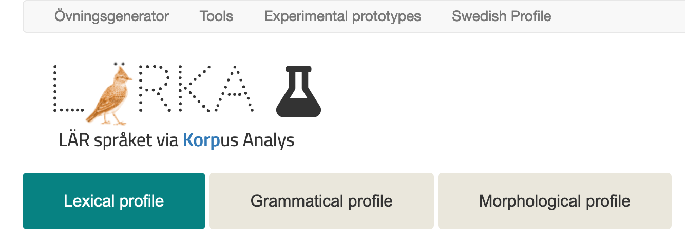
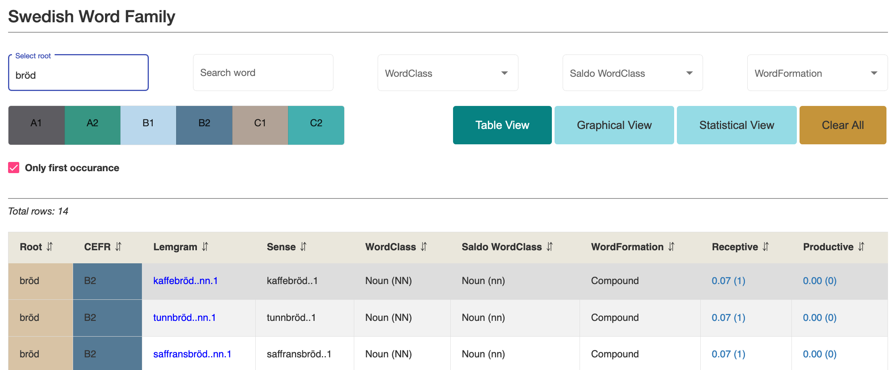
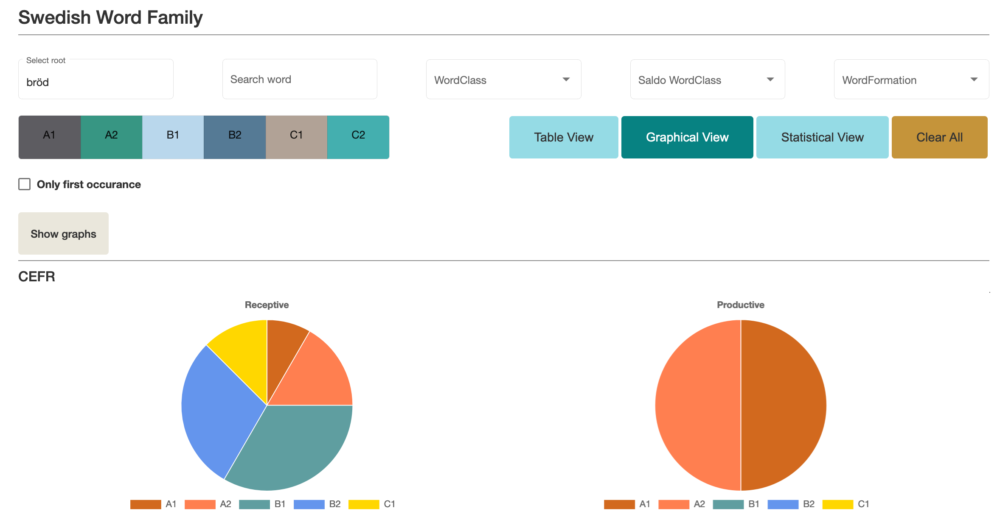
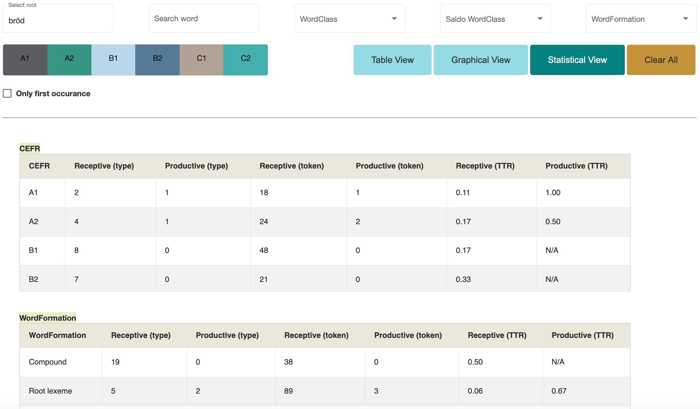

# Swedish L2 profiles
_Elena Volodina and Therese Lindström Tiedemann, September 2021_

Online version: [https://spraakbanken.github.io/L2_profiles/VSwedishL2profiles](https://spraakbanken.github.io/L2_profiles/VSwedishL2profiles)

_____________________________________________________________________________________

## Contents

[General description](#general-description)

   - [L2P project](#l2p-project)
 
   - [Corpora used in the project](#corpora-used-in-the-project)
 
[User interface](#user-interface)
   
  - [Filters](#filters)

  - [Table view](#table-view)

      - 

  - [Graphical view](#graphical-view)

      - 

      - 

   - [Statistical view](#statistical-view)

      - 

      - 

[Swedish lexical profile](#swedish-lexical-profile)

   - [Adjectival declension](#adjectival-declension)
   
   - [Adjectival adverbial structure](#adjectival-adverbial-structure)
   
   - [Multi-word expressions](#multi-word-expressions)
   
   - [Sen\*Lex](#senlex)
   

[Swedish grammatical profile](#swedish-grammatical-profile)

   - 
   
   - 
   
   - 
   
   - 
   
   - 
   
   - 

[Swedish morphological profile](#swedish-morphological-profile)

   - [Word family](#word-family)
   
   - [Morpheme family](#morpheme-family)
   
   - 
   
   - 
   
   - 
   
   - 

_____________________________________________________________________________________

## General description

_____________________________________________________________________________________

### L2P project

The project [Development of lexical and grammatical competences in immigrant Swedish](https://spraakbanken.gu.se/en/projects/l2profiles), funded by Riksbankens Jubileumsfond, 2018-2021, focused on analysis of learners' vocabulary and grammar, and how they are learnt. We performed the study through two corpora: a corpus of coursebook texts and a corpus of learner essays (see below), both marked up for proficiency levels according to the Common European Framework of References (CEFR). The corpora have been processed by computational methods, after which the results have been analysed by linguists, lexicographers, grammarians, teachers and language assessors - both linguistically, and based on theory of teaching, to find ways of identifying minimal or central (need-to-know) vocabulary and grammar scopes, as well as peripheral (good-to-know) grammar and vocabulary at each level of proficiency as a way to support teachers, test-makers, assessor and learners. The aim of this project has, thus, been to provide an extensive description of what lexical and grammatical competence learners at each level possess, both receptively and productively, and explore the relation between the receptive and productive scopes. 

The project has resulted in a [Swedish L2 profiles](https://spraakbanken.gu.se/larkalabb/svlp) (SweL2P) resource - a practical digital tool that offers teachers, students, researchers and developers a possibility to explore and study themselves various aspects of learner language or use those for development of various methods or applications for second language learning. Since the focus of the project has been on description of learner language (rather than being of prescriptive nature), we offer all interested user groups a possibility to explore the [SweL2P](https://spraakbanken.gu.se/larkalabb/svlp) themselves and make their own conclusions. 

_____________________________________________________________________________________

### Corpora used in the project

**COCTAILL** is a corpus of course books used for teaching Swedish as a second language (L2). Each chapter is the course books has been marked by teachers for the level of proficiency at which it has been used in courses for non-native Swedish speakers. COCTAILL contains course books at five of the six CEFR (Common European Framework of Reference) levels: A1 (beginner), A2, B1, B2, C1 (advanced). C2 (near-native) is missing. This corpus is used to get an approximation of what vocabulary and grammar L2 learners meet when reading, and are expected to understand **receptively**.

*Statistics over Coctaill corpus (receptive)*

| CEFR level |  Nr sentences | Nr tokens | 
|:-----------|:--------------|:----------|
| A1         | 7 583         |37 149| 
| A2         | 14 006        |84 996|  
| B1         | 18 528        |154 013| 
| B2         | 16 649        |164 322| 
| C1         | 16 668        |176 634| 
| C2         | 0             |0| 
| None       | 3 397         |34 885| 
| Total      | 76 831        |651 999|

_Reference_: 
* Elena Volodina, Ildikó Pilán, Stian Rødven Eide and Hannes Heidarsson 2014. [You get what you annotate: a pedagogically annotated corpus of coursebooks for Swedish as a Second Language.](http://www.ep.liu.se/ecp/107/010/ecp14107010.pdf) Proceedings of the third workshop on NLP for computer-assisted language learning. NEALT Proceedings Series 22 / Linköping Electronic Conference Proceedings 107: 128–144.

_____________________________________________________________________________________

**SweLL-pilot** is a corpus contating essays written by learners of Swedish as a second language. The essays have been collected from three separate schools, and have been labeled with the CEFR labels by experts. Essays represent the six levels A1 - C2, although C2 is represented by two essays only. This corpus is used to get an approximation of what vocabulary and grammar L2 learners are able to produce actively when writing, and therefore represent learners' **productive** abilities.

*Statistics over SweLL-pilot corpus (productive)*

| CEFR level | Nr sentences| Nr tokens  |     
|:-----------|:------------|:-----------|
| A1         | 633         |5 172       |  
| A2         | 2 616       |27 304      | 
| B1         | 1 719       |24 853      |
| B2         | 2 691       |45 684      |
| C1         | 2 887       |52 048      |
| C2         | 175         |3 294       |
| None       | 148         |1 706       |
| Total      | 10 869      |160 061     |

_References_: 

* Elena Volodina, Ildikó Pilán, Ingegerd Enström, Lorena Llozhi, Peter Lundkvist, Gunlög Sundberg, Monica Sandell. 2016. [SweLL on the rise: Swedish Learner Language corpus for European Reference Level studies.](http://arxiv.org/pdf/1604.06583v1.pdf) Proceedings of LREC 2016, Slovenia.
* Description per subcorpus:
    * SpIn (part of SweLL-pilot): https://spraakbanken.github.io/swell-release-v1/Metadata-SpIn
    * SW1203 (part of SweLL-pilot): https://spraakbanken.github.io/swell-release-v1/Metadata-SW1203
    * TISUS 2007 (part of SweLL-pilot): https://spraakbanken.github.io/swell-release-v1/Metadata-TISUS

_____________________________________________________________________________________

## User interface

_____________________________________________________________________________________

The [SweL2P](https://spraakbanken.gu.se/larkalabb/svlp) features three main profiles:

* **lexical** profile, organized by words, multi-word expressions and a few other aspects of vocabulary
* **grammatical** profile, organized by noun phrases, verb phrases and morpho-syntactic tendencies
* **morphological** profile, organized into word family and morpheme family

Each item and pattern in the profile can be **filtered** in various ways depending on the category in focus, explored through actual corpus **hits in Korp** and associated information in a **Table view**, studied through **Statistical view** and/or graphs in the **Graphical view**. Each filtered data selection can be downloaded. 

For each of the three profiles ([lexical](https://spraakbanken.github.io/L2_profiles/SwedishL2profiles#swedish-lexical-profile), grammatical and [morphological](https://github.com/spraakbanken/L2_profiles/blob/master/SwedishL2profiles.md#swedish-morphological-profile)), you can find a more detailed description under the relevant subsection in this document.

_____________________________________________________________________________________

### Filters

_____________________________________________________________________________________

### Table view

Link: https://github.com/spraakbanken/L2_profiles/blob/master/SwedishL2profiles.md#table-view

Thr **Table view** lists all items in focus, e.g. multi-word expressions or a verb patterns, one by one, with associated information about it (similar to an Excel sheet). Columns  with descriptive information depend on the item in focus, for example, 

* CEFR level they appear at - once for each level where they appear
* 

**CEFR level** 

**Focus item**

**Columns**

_____________________________________________________________________________________

### Frequency information

**Receptive**. Column with "Receptive" frequency shows relative and absolute hits of an item/pattern in the texts in the coursebook corpus Coctaill. The relative frequency is normalized 

- towards the tokens per level (Lexical and Morphological profile)
- towards number of sentences at a given level of proficiency (Grammar profile). For example, if we have 20 hits in  Coctaill at C1 level, and we know that 

_____________________________________________________________________________________

### Graphical view

_____________________________________________________________________________________

### Statistical view

_____________________________________________________________________________________

## Swedish lexical profile

_____________________________________________________________________________________

### Adjectival declension

### Adjectival adverbial structure

### Multi-word expressions

### Sen\*Lex

_____________________________________________________________________________________

## Swedish grammatical profile

_____________________________________________________________________________________

### Morpho-syntactic descriptors

### Noun phrases

### Verb phrases

#### Filters

#### Columns

_____________________________________________________________________________________

## Swedish morphological profile

_____________________________________________________________________________________

### Word family

### Morpheme family
